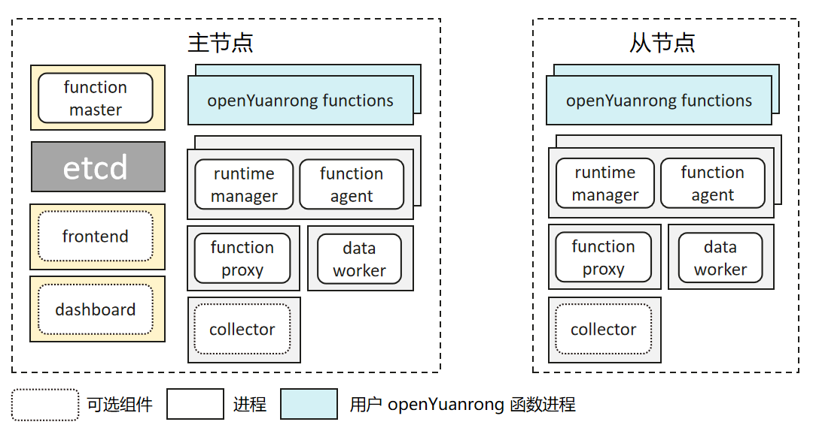

# 在主机上部署 openYuanrong 集群

```{eval-rst}
.. toctree::
   :glob:
   :maxdepth: 1
   :hidden:

   single-node-deployment
   production/index.md
   parameters
```

本节将介绍如何在 Linux 主机上部署 openYuanrong 集群。

## 概述

openYuanrong 集群由主节点和从节点组成。主节点默认只部署一个，在高可靠场景下，也可按主备方式部署多个。从节点可以部署任意多个，它由主节点管理。openYuanrong 组件和用户函数以进程的方式运行在节点上。



- 学习和开发可参考[入门](./single-node-deployment.md)，使用默认配置在一台或者多台主机上部署 openYuanrong 。

- 生产环境部署可参考[用户指南](./production/index.md)，包含配置项介绍、安全、集群运维等更多内容。

### 主节点

主节点用于管理集群，负责全局函数调度、请求转发等工作。除包含从节点上的组件外，还部署有 function master 及开源 etcd。

### 从节点

从节点用于运行分布式任务，部署的 openYuanrong 组件有 function proxy、function agent、runtime manager、data worker。

### 组件介绍

- **function master**

  负责拓扑管理、全局函数调度、函数实例生命周期管理及 function agent 组件的扩缩容。
- **etcd**

  第三方开源组件，用于存储集群组件注册信息、函数元数据以及实例状态等信息。
- **function proxy**

  负责消息转发、本地函数调度及实例生命周期管理。
- **function agent**

  最小资源单元，负责函数代码包下载和解压、网络安全隔离配置等。与 runtime manager 共进程部署。
- **runtime manager**

  负责 cpu、memory 等资源采集和上报、函数进程生命周期管理等。与 function agent 共进程部署。
- **data worker**

  提供数据对象的存取等能力。
