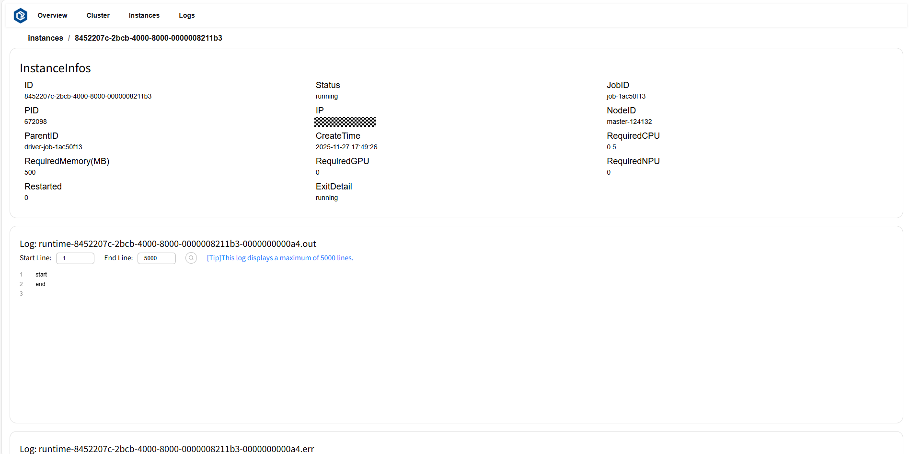

# Dashboard

openYuanrong 提供了可视化的 `dashboard` ，用于查看集群和函数实例的状态等信息，便于监控和快速排查问题。目前 dashboard 支持上千条实例数据的稳定承载与展示。

## 启动 Dashboard

要访问 `dashboard` ，需要在部署 openYuanrong 集群主节点时，加上 *`--enable_dashboard=true`* 参数以及依赖项参数。使用 dashboard 全量功能，主节点的部署命令如下：

```bash
yr start --master --enable_dashboard=true --enable_collector=true --enable_separated_redirect_runtime_std=true --prometheus_address={prometheus_ip}:{prometheus_port} --enable_metrics=true --metrics_config_file={file_name}.json --port_policy=FIX
```

您可参考[部署参数表](../deploy/deploy_processes/parameters.md)按需裁剪不需要的功能。

- enable_collector、enable_separated_redirect_runtime_std 参数提供收集函数实例日志功能，影响日志页面内容的显示。
- prometheus_address、enable_metrics、metrics_config_file 参数提供收集指标数据功能，影响 Cluster 页面表格中 CPU、Memory、NPU、Disk 项的显示。开启功能需部署 prometheus 服务，请参考[部署 prometheus](observability-prometheus)。
- port_policy 参数用于固定 dashboard 的服务端口。

部署成功将打印包含 `local_ip` 和 `dashboard_port` 信息，如下所示：

```bash
Yuanrong deployed succeed
Cluster master info:
    local_ip:x.x.x.x,master_ip:x.x.x.x,etcd_ip:x.x.x.x,etcd_port:32379,global_scheduler_port:22770,ds_master_port:12123,etcd_peer_port:32380,bus-proxy:22772,bus:22773,ds-worker:31501,dashboard_port:9080,
```

使用 `http://local_ip:dashboard_port` 作为 `dashboard` 的 URL (默认 URL 为 `http://localhost:9080`)。

从节点的部署无需 `enable_dashboard` 和 `prometheus_address` 参数，其他参数按需配置，参考如下命令：

```bash
# 使用前一步骤打印的主节点信息替换引号中的内容。
yr start --enable_collector=true --enable_separated_redirect_runtime_std=true --enable_metrics=true --metrics_config_file={file_name}.json --master_info "local_ip:x.x.x.x,master_ip:x.x.x.x,etcd_ip:x.x.x.x,etcd_port:32379,global_scheduler_port:22770,ds_master_port:12123,etcd_peer_port:32380,bus-proxy:22772,bus:22773,ds-worker:31501,dashbaord_port:9080,"
```

## 页面介绍

`dashboard` 有多个页面，根据功能查看对应页面：

* 查看总逻辑资源占用率：[Overview 页面](observability-dashboard-overview)，[Cluster 页面](observability-dashboard-cluster)
* 概览所有组件和实例状态：[Overview 页面](observability-dashboard-overview)
* 查看所有节点和组件的状态和逻辑资源占用率：[Cluster 页面](observability-dashboard-cluster)
* 查看所有实例的任务进度和状态：[Instances 页面](observability-dashboard-instances)
* 查看实例的日志和错误信息：[Logs 页面](observability-dashboard-logs)

(observability-dashboard-overview)=

### Overview 页面

Overview 页面可以查看总逻辑资源占用率、概览所有组件和实例状态。

* 逻辑资源卡片(Logical Resources)展示了 Logical CPU 总占用核数、总核数及总占用率，Logical Memory 总占用量(GB)、总内存量(GB)及总占用率。
* 集群状态卡片(Cluster Status)展示了总节点数和活跃节点数。
* 实例状态卡片(Instances)展示了总实例数和 `running` 、`exited`、`fatal` 状态实例数。

页面示例：


(observability-dashboard-cluster)=

### Cluster 页面

Cluster 页面可以查看总逻辑资源占用率，所有节点和组件的状态及各资源指标使用情况，并将节点和组件的层次关系可视化。

* 逻辑资源卡片(Logical Resources)展示了 Logical CPU 总占用核数、总核数及总占用率，Logical Memory 总占用量(GB)、总内存量(GB)及总占用率。
* 组件卡片(Components)展示了节点(node)的状态、地址、CPU 和 NPU 占用率、Memory/Disk/Logical Resources 各指标的使用量、总量及占用率；运行在对应节点上的代理(agent)的状态、地址、Logical Resources 指标的使用量、总量及占用率；运行在对应代理上的实例(instance)的状态、地址、CPU 和 NPU 占用率、Memory/Logical Resources 各指标的使用量、总量及占用率。

页面示例：


(observability-dashboard-instances)=

### Instances 页面

Instances 页面可以查看所有实例的详细信息。

实例详细信息说明：

* ID：实例 id。
* status：实例状态。
* jobID：实例对应 job 的 id。
* PID：运行实例进程的 pid。
* IP：运行节点的 ip。
* nodeID：运行节点的 id。
* parentID：父实例的 id。
* createTime：实例的创建时间。
* required CPU：实例需要的 CPU 核数。
* required Memory：实例需要的内存量，单位为 MB。
* required GPU：实例需要的 GPU 核数。
* required NPU：实例需要的 NPU 核数。
* restarted：实例重启次数。
* exitDetail：实例退出时的详细信息。

页面示例：


点击 `ID` 或 `log` 跳转至实例详情页。其中实例详情卡片(InstanceInfos)展示了此实例的详细信息，日志卡片(Log)显示此实例的日志和错误信息。

页面示例：



(observability-dashboard-logs)=

### Logs 页面

Logs 页面可以查看所有日志内容和错误信息。页面示例：


点击选中的节点，可查看该节点下所有日志文件列表。页面示例：


点击想要查看的文件，即可展示文件内容。页面示例：


(observability-prometheus)=

## 部署 Prometheus

openYuanrong 通过 Pushagteway 推送数据到 Prometheus，首先[下载 pushgateway](https://github.com/prometheus/pushgateway/releases){target="_blank"} 并参考如下命令部署。

```shell
tar -xzvf pushgateway-x.xx.x.linux-amd64.tar.gz # tar 包名替换为您下载的文件名
cd pushgateway-x.xx.x.linux-amd64
nohup ./pushgateway > ./pushgateway.log 2>&1 & # pushgateway 默认端口为 9091
```

然后[下载 prometheus](https://prometheus.io/download/){target="_blank"} 并参考如下步骤部署。

```shell
tar -xzvf prometheus-x.x.x.linux-amd64.tar.gz # tar 包名替换为您下载的文件名
cd prometheus-x.x.x.linux-amd64
```

### 配置 prometheus

修改 `prometheus-x.x.x.linux-amd64/prometheus.yml` 文件，在 `scrape_configs` 配置项添加如下内容，其中 `127.0.0.1` 替换为运行 pushgateway 的机器 IP。

```bash
- job_name: 'pushgateway'
  static_configs:
    - targets: ['127.0.0.1:9091'] 
```

### 启动 prometheus

```shell
nohup ./prometheus > ./prometheus.log 2>&1 & # prometheus 默认端口为 9090
```
