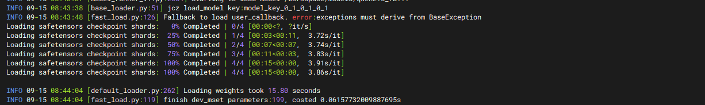
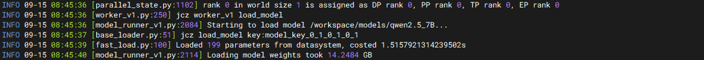

# 推理实例模型加载速度 10 倍提升，快速弹性响应业务流量变化

大模型推理在面对高负载或突发情况时，推理实例的弹性速度能帮助系统快速调整资源，防止服务中断或性能下降，保证实时性和用户体验。同时更快的弹性速度允许系统根据实时负载自动调整计算资源，高负载时快速扩展，低负载时及时释放，避免资源浪费。

推理实例的弹性速度受多种因素的影响，如任务调度算法、异构资源的数量和性能、推理模型加载速度等，其中模型加载速度随着模型越来越大问题变得更突出。基于 openYuanrong 提供的异构数据对象 API，可实现模型一次冷加载，通过异构对象共享模型参数，再次扩容推理实例时高速获取。

## 方案介绍

本案例基于 vLLM 推理框架在昇腾环境上部署并扩容一个 Qwen 推理实例，通过以下步骤向您介绍如何使用 openYuanrong 异构数据对象 API：

- 在基于 openEuler 的 [vLLM Ascend](https://vllm-ascend.readthedocs.io/zh-cn/latest/){target="_blank"} 容器镜像环境中部署 openYuanrong。
- 提供 vLLM 补丁适配 openYuanrong 异构数据对象 API。
- 使用 openYuanrong 基于 vLLM 部署并扩容一个 Qwen 推理实例，测试加速效果。

## 准备工作

准备一台昇腾主机（至少有两张可用 NPU 卡）并在主机上创建目录 `/workspace/models` 用于存放模型文件，创建目录 `/workspace/tools` 用于存放其他依赖文件。

1. 在主机上安装 docker 并从 [quay.io 镜像仓库](https://quay.io/repository/ascend/vllm-ascend?tab=tags&tag=latest){target="_blank"}拉取 `quay.io/ascend/vllm-ascend:v0.10.0rc1-openeuler` 镜像，镜像内含 vLLM 及 vLLM Ascend v0.10.0rc1 版本。

2. 下载 Qwen2.5-7B-Instruct 模型文件到主机，存放在 `/workspace/models/qwen2.5_7B` 目录下。

3. 下载使用 openYuanrong 开发的 [模型部署脚本](https://gitee.com/openeuler/yuanrong-runtime/files?ref=br_opensource_master&filePath=docs%2Fsample_code%2Fllm_on_multiple_machines){target="_blank"}(包含目录内的所有文件)，存放在 `/workspace/tools/deploy` 目录下。

4. 下载 [vLLM Ascend 补丁](https://gitee.com/openeuler/yuanrong-datasystem/files?ref=br_opensource_master&filePath=tests%2Fkvconnector%2Fpatch){target="_blank"}(包含目录内的所有文件)，存放在 `/workspace/tools/patch` 目录下。

5. 在 `/workspace/tools` 目录下创建 vLLM 补丁文件 `vllm.patch`，内容如下：

    ```diff
    diff --git a/kernel_meta/buildPidInfo.json b/kernel_meta/buildPidInfo.json
    new file mode 100644
    index 0000000..c4ca3fd
    --- /dev/null
    +++ b/kernel_meta/buildPidInfo.json
    @@ -0,0 +1,6 @@
    +[
    +    [
    +        57487,
    +        "/vllm-workspace/vllm/kernel_meta/kernel_meta_11984694443134222033"
    +    ]
    +]
    \ No newline at end of file
    diff --git a/vllm/model_executor/model_loader/base_loader.py b/vllm/model_executor/model_loader/base_loader.py
    index 4cf6c79..9038a27 100644
    --- a/vllm/model_executor/model_loader/base_loader.py
    +++ b/vllm/model_executor/model_loader/base_loader.py
    @@ -45,7 +45,12 @@ class BaseModelLoader(ABC):
                                              model_config=model_config)

                 logger.debug("Loading weights on %s ...", load_device)
    +            from vllm.model_executor.model_loader.fast_load import fast_load_weights, get_model_key
                 # Quantization does not happen in `load_weights` but after it
    -            self.load_weights(model, model_config)
    +            model_key = get_model_key("model_key")
    +            logger.info(f"load_model key:{model_key}")
    +            fast_load_weights(model, model_key, self.load_weights, model_config)
    +            # self.load_weights(model, model_config)
    +
                 process_weights_after_loading(model, model_config, target_device)
             return model.eval()
    diff --git a/vllm/model_executor/model_loader/fast_load.py b/vllm/model_executor/model_loader/fast_load.py
    new file mode 100644
    index 0000000..6a26ba1
    --- /dev/null
    +++ b/vllm/model_executor/model_loader/fast_load.py
    @@ -0,0 +1,128 @@
    +import time
    +import os
    +import torch
    +
    +from datasystem.hetero_client import HeteroClient, Blob, DeviceBlobList
    +from datasystem.ds_tensor_client import DsTensorClient
    +from torch_npu.npu import current_device
    +from vllm.distributed.parallel_state import (
    +    get_tp_group, get_ep_group, get_pp_group
    +)
    +
    +from vllm.logger import logger
    +from collections import OrderedDict
    +
    +_global_tensor_client = None
    +_global_hetero_client = None
    +_DEV_MGET_TIMEOUT_MS = 10 * 1000
    +CHUNK_SIZE = 100
    +
    +def get_model_key(model_id: str):
    +    tp_world_size = get_tp_group().world_size
    +    pp_world_size = get_pp_group().world_size
    +    tp_rank = get_tp_group().rank
    +    pp_rank = get_pp_group().rank
    +    ep_world_size = get_ep_group().world_size
    +    ep_rank = get_ep_group().rank
    +    key = model_id + f"_{tp_rank}_{tp_world_size}_{pp_rank}_{pp_world_size}"
    +    key += f"_{ep_rank}_{ep_world_size}"
    +    return key
    +
    +
    +def get_tensor_client():
    +    global _global_tensor_client
    +
    +    if _global_tensor_client:
    +        return _global_tensor_client
    +
    +    ds_worker_addr = _inspect_data_system_address()
    +    if ds_worker_addr.find(":") == -1:
    +        raise ValueError(
    +            "Invalid address of data system worker: {}, expect 'ip:port'".format(ds_worker_addr))
    +    host, port = ds_worker_addr.split(":")
    +    port = int(port)
    +    _global_tensor_client = DsTensorClient(host, port, current_device())
    +    _global_tensor_client.init()
    +
    +    return _global_tensor_client
    +
    +
    +def get_hetero_client():
    +    """
    +    Create ds hetero client if not initialized, otherwise returns the previously created one.
    +
    +    :return: HeteroClient
    +    """
    +    global _global_hetero_client
    +
    +    if _global_hetero_client:
    +        return _global_hetero_client
    +
    +    ds_worker_addr = _inspect_data_system_address()
    +    if ds_worker_addr.find(":") == -1:
    +        raise ValueError(
    +            "Invalid address of data system worker: {}, expect 'ip:port'".format(ds_worker_addr))
    +    host, port = ds_worker_addr.split(":")
    +    port = int(port)
    +    _global_hetero_client = HeteroClient(host, port)
    +    _global_hetero_client.init()
    +
    +    return _global_hetero_client
    +
    +
    +def _inspect_data_system_address():
    +    for address in [
    +        # yr.config_manager.ConfigManager().ds_address,
    +        os.getenv("DS_WORKER_ADDR"),
    +    ]:
    +        if address and len(address) != 0:
    +            return address
    +    raise RuntimeError("cannot inspect data system address")
    +
    +
    +def _load_from_ds(model, key: str):
    +    start_time = time.time()
    +    tensor_client = get_tensor_client()
    +    tensor_list = []
    +    num_load_success_param = 0
    +    named_tensors = OrderedDict()
    +    for name, param in model.named_parameters():
    +        named_tensors[name] = param.data
    +    for name, param in named_tensors.items():
    +        tensor_list.append(param)
    +    key_list = [key + f"index_{index}" for index in range(len(tensor_list))]
    +    try:
    +        tensor_client.dev_mget(key_list, tensor_list, _DEV_MGET_TIMEOUT_MS)
    +        num_load_success_param += len(tensor_list)
    +    except Exception as e:
    +        raise f"dev_mget failed, error: {e}"
    +
    +    logger.info(f"Loaded {num_load_success_param} parameters from datasystem, costed {time.time() - start_time}s")
    +    return num_load_success_param
    +
    +
    +def _publish_to_ds(model, key: str):
    +    start_time = time.time()
    +    tensor_client = get_tensor_client()
    +    tensor_list = []
    +    named_tensors = OrderedDict()
    +    for name, param in model.named_parameters():
    +        named_tensors[name] = param.data
    +    for name, param in named_tensors.items():
    +        tensor_list.append(param)
    +    key_list = [key + f"index_{index}" for index in range(len(tensor_list))]
    +    try:
    +        tensor_client.dev_mset(key_list, tensor_list)
    +    except Exception as e:
    +        logger.error(f"dev_mset failed, error: {e}")
    +
    +    logger.info(f"finish dev_mset parameters:{len(tensor_list)}, costed {time.time() - start_time}s")
    +
    +
    +def fast_load_weights(model, key: str, load_callback, model_config):
    +    try:
    +        _load_from_ds(model, key)
    +    except Exception as e:
    +        logger.info(f"Fallback to load user_callback. error:{e}")
    +        load_callback(model, model_config)
    +        _publish_to_ds(model, key)
    \ No newline at end of file
    ```

    补丁在 `/vllm/model_executor/model_loader/base_loader.py` 文件中适配 openYuanrong 提供的模型快速加载能力。首个推理实例加载模型时，openYuanrong 数据系统中没有模型的元数据信息， `fast_load_weights()` 函数将使用默认方式（本地）加载模型并发布元数据到 openYuanrong 数据系统。再次拉起相同的推理实例时，因在 openYuanrong 数据系统中查询到相同的元数据信息，模型将从已部署的推理实例显存中快速同步。

    实际上，补丁代码核心逻辑是调用 openYuanrong 数据系统的 `dev_mset()` 和 `dev_mget()` 接口，您可以方便地使用该接口在其他推理框架中实现相同的能力。

## 在容器中部署 openYuanrong

参考如下命令运行容器，启动参数的配置介绍详见 [vLLM Ascend 文档](https://vllm-ascend.readthedocs.io/zh-cn/latest/tutorials/index.html#){target="_blank"}：

```bash
# 请自定义 docker_name，并根据实际主机 NPU 卡的情况配置 device
docker run \
--name "docker_name" \
--privileged \
-itu root \
-d --shm-size 64g \
--net=host \
--device=/dev/davinci0:/dev/davinci0 \
--device=/dev/davinci1:/dev/davinci1 \
--device=/dev/davinci2:/dev/davinci2 \
--device=/dev/davinci3:/dev/davinci3 \
--device=/dev/davinci4:/dev/davinci4 \
--device=/dev/davinci5:/dev/davinci5 \
--device=/dev/davinci6:/dev/davinci6 \
--device=/dev/davinci7:/dev/davinci7 \
--device=/dev/davinci_manager:/dev/davinci_manager \
--device=/dev/devmm_svm:/dev/devmm_svm \
--device=/dev/hisi_hdc:/dev/hisi_hdc \
-v /usr/local/dcmi:/usr/local/dcmi \
-v /usr/local/bin/npu-smi:/usr/local/bin/npu-smi \
-v /usr/local/Ascend/driver/lib64/:/usr/local/Ascend/driver/lib64/ \
-v /usr/local/Ascend/driver/version.info:/usr/local/Ascend/driver/version.info \
-v /usr/bin/hccn_tool:/usr/bin/hccn_tool \
-v /etc/ascend_install.info:/etc/ascend_install.info \
-v /root/.cache:/root/.cache \
-v /workspace:/workspace \
-it quay.io/ascend/vllm-ascend:v0.10.0rc1-openeuler bash
```

:::{Note}

以下操作均在容器中进行。

:::

1. 为 vLLM 打补丁

    ```bash
    cd /vllm-workspace/vllm
    git apply /workspace/tools/vllm.patch
    ```

2. 为 vLLM Ascend 打补丁

   ```bash
   cd /vllm-workspace/vllm-ascend
   git am /workspace/tools/patch/0001-implement-chariot-ds-connector-and-support-multimoda.patch
   python setup.py develop
   ```

3. 安装 openYuanrong

   ```bash
   pip install openyuanrong
   ```

4. 部署 openYuanrong

   执行如下命令部署：

   ```bash
   # 替换 MASTER_IP 为您当前主机 IP，选择任意空闲端口配置 etcd_port 和 etcd_peer_port
   yr start --master -l DEBUG --runtime_direct_connection_enable=true --enable_separated_redirect_runtime_std=true --etcd_addr_list=${MASTER_IP}  --etcd_port=22440 --etcd_peer_port=22441
   ```

   记录命令输出 `Cluster master info:` 中的 `ds_master_port` 端口，例如 11373。配置环境变量：`export DS_WORKER_ADDR=${MASTER_IP}:11373`

   检查部署状态，显示 agent 个数为 1：

   ```bash
   yr status --etcd_endpoint ${MASTER_IP}:22440

   # ...
   # YuanRong cluster status:
   #    current running agents: 1
   ```

## 部署首个 Qwen 推理实例

在容器内分别配置如下环境变量：

```bash
# 推理服务端口
export SERVER_PORT=9000

# 模型文件路径
export MODEL_PATH="/workspace/models/qwen2.5_7B"
export PYTHONPATH=$PYTHONPATH:/workspace/tools/deploy

# 启用 vLLM 的 v1 API 模式
export VLLM_USE_V1=1
# Python 多进程启动方式为 spawn
export VLLM_WORKER_MULTIPROC_METHOD=spawn
# 模型在单卡上执行需要的显存容量，Qwen2.5-7B设置20刚好合适
export vLLM_MODEL_MEMORY_USE_GB=20
export PROTOCOL_BUFFERS_PYTHON_IMPLEMENTATION=python

# 替换 YR_INSTALL_PATH 为 openYuanrong 安装路径，可使用 yr version 命令查看
# 例如：/usr/local/Python-3.11.9/lib/python3.11/site-packages/yr/inner
export LD_LIBRARY_PATH=${YR_INSTALL_PATH}/function_system/lib:$LD_LIBRARY_PATH
export HCL_OP_EXPANSION_MODE="AIV"
# 是否启用 openYuanrong 多级缓存前缀匹配能力，值为 1 表示启动
export USING_PREFIX_CONNECTOR=1

export PREFILL_INS_NUM=1
export DECODE_INS_NUM=0
export PTP=2
export DTP=0
export PDP=1
export DDP=0
```

在 openYuanrong 主节点所在容器 `/workspace/tools/deploy` 目录下，执行如下命令部署：

```bash
bash run_vllm_on_yr.sh deploy

# 查看部署日志
tail -f deploy.log
```

预期输出如下，模型加载用时约 15.8 秒：



## 扩容一个 Qwen 推理实例

在容器中执行如下命令扩容推理实例：

```bash
# 替换 MASTER_IP 为您当前主机 IP
curl --location --request POST 'http://${MASTER_IP}:9000/scaleout' --data ''
```

预期输出如下，模型加载用时约 1.5 秒，10 倍的加速性能提升：


