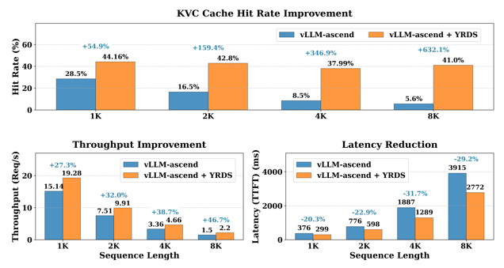

# 基于 vLLM 部署多机 PD 分离服务，长序列推理 TTFT 下降 20%

长序列推理可以让大语言模型真正理解和处理复杂问题。比如聊天机器人需要在多轮对话中保持连贯性，以提供更人性化的服务。然而，随着输入序列的增加，推理服务也面临不小的挑战：

1. 计算复杂度急剧增加：计算复杂度与序列长度的平方成正比，常见优化方案是使用 PD(Prefill-Decode) 分离的推理架构，多机部署 Prefill 和 Decode 实例，但需要处理好跨机传递 KV Cache 问题。
2. 显存瓶颈：KV Cache 会占用大量显存，限制了模型可以处理的最大上下文长度。

openYuanrong 提供了分布式多级缓存 (HBM/DRAM/SSD) 和高性能 D2D(device to device)/H2D(host to deveice)/D2H(device to host) 访问能力，可显著降低长序列推理 TTFT(time to first token) 时延，提升推理服务的吞吐：

1. 多机部署的 PD 分离推理实例，可通过 openYuanrong 数据系统加速 KV Cache 从 Prefill 到 Decode 实例的跨机传递。
2. 显存不足时，可缓存溢出的数据到 openYuanrong 数据系统，提升 KV Cache 命中率，减少重复计算。

## 方案介绍

本案例基于 vLLM 推理框架部署一个 PD 分离的 Qwen 推理服务，通过以下步骤向您介绍如何使用 openYuanrong 异构分布式多级缓存能力：

- 在基于 openEuler 的 [vLLM Ascend](https://vllm-ascend.readthedocs.io/zh-cn/latest/){target="_blank"} 容器镜像环境中部署 openYuanrong。
- 为 vLLM Ascend 打补丁适配 openYuanrong 分布式多机缓存能力。
- 跨主机在容器中部署 PD 分离的 Qwen 推理服务，测试长序列推理效果。

## 准备工作

准备两台昇腾主机（每台至少有一张可用 NPU 卡）并在主机上创建目录 `/workspace/models` 用于存放模型文件，创建目录 `/workspace/tools` 用于存放其他依赖。

1. 在主机上安装 docker 并从 [quay.io 镜像仓库](https://quay.io/repository/ascend/vllm-ascend?tab=tags&tag=latest){target="_blank"}拉取 `quay.io/ascend/vllm-ascend:v0.10.0rc1-openeuler` 镜像，镜像内含 vLLM 及 vLLM Ascend v0.10.0rc1 版本。

2. 下载 Qwen2.5-7B-Instruct 模型文件到主机，存放在 `/workspace/models/qwen2.5_7B` 目录下。

3. 下载使用 openYuanrong 开发的 [模型部署脚本](https://gitee.com/openeuler/yuanrong-runtime/files?ref=br_opensource_master&filePath=docs%2Fsample_code%2Fllm_on_multiple_machines){target="_blank"}(包含目录内的所有文件)，存放在 `/workspace/tools/deploy` 目录下。

4. 下载 [vLLM Ascend 补丁](https://gitee.com/openeuler/yuanrong-datasystem/files?ref=br_opensource_master&filePath=tests%2Fkvconnector%2Fpatch){target="_blank"}(包含目录内的所有文件)，存放在 `/workspace/tools/patch` 目录下。

## 在容器中部署 openYuanrong

在两台主机上分别使用如下命令运行容器，启动参数的配置介绍详见 [vLLM Ascend 文档](https://vllm-ascend.readthedocs.io/zh-cn/latest/tutorials/index.html#){target="_blank"}：

```bash
# 请自定义 docker_name，并根据实际主机 NPU 卡的情况配置 device
docker run \
--name "docker_name" \
--privileged \
-itu root \
-d --shm-size 64g \
--net=host \
--device=/dev/davinci0:/dev/davinci0 \
--device=/dev/davinci1:/dev/davinci1 \
--device=/dev/davinci2:/dev/davinci2 \
--device=/dev/davinci3:/dev/davinci3 \
--device=/dev/davinci4:/dev/davinci4 \
--device=/dev/davinci5:/dev/davinci5 \
--device=/dev/davinci6:/dev/davinci6 \
--device=/dev/davinci7:/dev/davinci7 \
--device=/dev/davinci_manager:/dev/davinci_manager \
--device=/dev/devmm_svm:/dev/devmm_svm \
--device=/dev/hisi_hdc:/dev/hisi_hdc \
-v /usr/local/dcmi:/usr/local/dcmi \
-v /usr/local/bin/npu-smi:/usr/local/bin/npu-smi \
-v /usr/local/Ascend/driver/lib64/:/usr/local/Ascend/driver/lib64/ \
-v /usr/local/Ascend/driver/version.info:/usr/local/Ascend/driver/version.info \
-v /usr/bin/hccn_tool:/usr/bin/hccn_tool \
-v /etc/ascend_install.info:/etc/ascend_install.info \
-v /root/.cache:/root/.cache \
-v /workspace:/workspace \
-it quay.io/ascend/vllm-ascend:v0.10.0rc1-openeuler bash
```

:::{Note}

以下操作均在容器中进行。

:::

1. 为 vLLM Ascend 打补丁

   ```bash
   cd /vllm-workspace/vllm-ascend
   git am /workspace/tools/patch/0001-implement-chariot-ds-connector-and-support-multimoda.patch
   python setup.py develop
   ```

2. 安装 openYuanrong

   ```bash
   pip install openyuanrong
   ```

3. 部署 openYuanrong

   任选一台主机作为主节点执行如下命令部署：

   ```bash
   # 替换 MASTER_IP 为您当前主机 IP，选择任意空闲端口配置 etcd_port 和 etcd_peer_port
   yr start --master -l DEBUG --runtime_direct_connection_enable=true --enable_separated_redirect_runtime_std=true --etcd_addr_list=${MASTER_IP}  --etcd_port=22440 --etcd_peer_port=22441
   ```

   另一台作为从节点执行如下命令部署：

   ```bash
   # 替换 MASTER_IP 为您主节点配置的 IP，etcd 相关端口和主节点的配置保持一致
   yr start -l DEBUG --runtime_direct_connection_enable=true --enable_separated_redirect_runtime_std=true --etcd_addr_list=${MASTER_IP}  --etcd_port=22440 --etcd_peer_port=22441
   ```

   检查部署状态，显示 agent 个数为 2：

   ```bash
   yr status --etcd_endpoint ${MASTER_IP}:22440

   # ...
   # YuanRong cluster status:
   #    current running agents: 2
   ```

## 使用脚本部署 Qwen PD 分离推理实例

在 openYuanrong 主从节点所在容器内分别配置如下环境变量并保持配置一致：

```bash
# 推理服务端口
export SERVER_PORT=9000

# 模型文件路径
export MODEL_PATH="/workspace/models/qwen2.5_7B"
export PYTHONPATH=$PYTHONPATH:/workspace/tools/deploy

# 启用 vLLM 的 v1 API 模式
export VLLM_USE_V1=1
# Python 多进程启动方式为 spawn
export VLLM_WORKER_MULTIPROC_METHOD=spawn
# 模型在单卡上执行需要的显存容量，Qwen2.5-7B设置20刚好合适
export vLLM_MODEL_MEMORY_USE_GB=20
export PROTOCOL_BUFFERS_PYTHON_IMPLEMENTATION=python

# 替换 YR_INSTALL_PATH 为 openYuanrong 安装路径，可使用 yr version 命令查看
# 例如：/usr/local/Python-3.11.9/lib/python3.11/site-packages/yr/inner
export LD_LIBRARY_PATH=${YR_INSTALL_PATH}/function_system/lib:$LD_LIBRARY_PATH
export HCL_OP_EXPANSION_MODE="AIV"
# 是否启用 openYuanrong 多级缓存前缀匹配能力，值为 1 表示启动
export USING_PREFIX_CONNECTOR=1
```

在 openYuanrong 主节点所在容器 `/workspace/tools/deploy` 目录下，执行如下命令部署：

```bash
bash run_vllm_on_yr.sh deploy

# 查看部署日志
tail -f deploy.log
```

PD 实例日志可在 openYuanrong 日志路径 `/tmp/yr_sessions/latest/log` 中查看。

参考如下示例验证推理服务正常工作：

```bash
curl -X POST "http://${MASTER_IP}:${SERVER_PORT}/v1/completions" \
     -H "Content-Type: application/json" \
     -d '{
          "model": "'"${MODEL_PATH}"'",
          "prompt": "介绍一下北京故宫，从地理位置、历史地位以及政治地位角度来说明",
          "max_tokens": 50,
          "temperature": 0
        }'
```

预期返回：

```json
{"id":"cmpl-5b342037-55e2-4af5-a54d-14a2bbe2c4d1","object":"text_completion","created":1757908624,"model":"/workspace/models/qwen2.5_7B","choices":[{"index":0,"text":"。\n北京故宫，又称紫禁城，位于中国北京市中心，是明清两代的皇宫，也是世界上现存规模最大、保存最完整的木质结构古建筑之一。故宫占地面积约72万平方米，建筑面积约15万平方米，共有宫殿","logprobs":null,"finish_reason":"length","stop_reason":null,"prompt_logprobs":null}],"service_tier":null,"system_fingerprint":null,"usage":{"prompt_tokens":15,"total_tokens":65,"completion_tokens":50,"prompt_tokens_details":null},"kv_transfer_params":null}
```

## 测试长序列推理效果

通过以下脚本生成长序列测试数据集，使用 vLLM 官方命令行工具做 Benchmark 测试。

```python
import os
import random
import string
import json
from tqdm import tqdm

def gen_random_string(length=10):
    """生成指定长度的随机字符串"""
    return "".join(random.choices(string.ascii_letters + string.digits, k=length))

def gen_random_seq(length=128):
    """生成由随机字符串组成的序列"""
    return " ".join([gen_random_string(5) for _ in range(length)])

def gen_random_prompts(num_groups, num_prompts_per_group, prefix_length=2048, suffix_length=1024):
    """生成随机提示数据集

    Args:
        num_groups: 分组数量
        num_prompts_per_group: 每组中的提示数量
        prefix_length: 前缀长度
        suffix_length: 后缀长度

    Returns:
        随机生成的提示列表
    """
    prompts = []
    print(f"开始生成数据集 (分组数: {num_groups}, 每组提示数: {num_prompts_per_group})...")

    for group_idx in tqdm(range(num_groups), desc="生成组"):
        # 为每个组生成一个固定的前缀
        prefix = gen_random_seq(prefix_length)

        # 为该组生成指定数量的提示
        for _ in range(num_prompts_per_group):
            suffix = gen_random_seq(suffix_length)
            prompt = prefix + " " + suffix
            prompts.append(prompt)

    random.shuffle(prompts)
    return prompts

def save_to_file(prompts, output_file):
    """将生成的提示保存为JSON格式，每条数据都用[]包裹"""
    with open(output_file, 'w', encoding='utf-8') as f:
        for prompt in tqdm(prompts, desc="写入文件"):
            # 每条数据都是一个单独的JSON数组
            data = [{"prompt": prompt}]
            json_line = json.dumps(data, ensure_ascii=False)
            f.write(json_line + '\n')

    print(f"已成功将 {len(prompts)} 条数据保存到 {output_file}")

def main():
    # 参数设置
    CONFIG = {
        'num_groups': 30,           # 分组数量
        'num_prompts_per_group': 100,  # 每组提示数量
        'prefix_length': 2048,      # 前缀长度（token数）
        'suffix_length': 6144,      # 后缀长度（token数）
        'output_dir': './data',     # 输出目录
        'output_file': 'dataset_8k.json',  # 输出文件名
        'seed': 42                  # 随机数种子
    }

    # 设置随机种子
    random.seed(CONFIG['seed'])

    # 创建输出目录
    os.makedirs(CONFIG['output_dir'], exist_ok=True)
    output_path = os.path.join(CONFIG['output_dir'], CONFIG['output_file'])

    # 生成数据集
    total_prompts = CONFIG['num_groups'] * CONFIG['num_prompts_per_group']
    print(f"总共将生成 {total_prompts} 条数据 (分组数: {CONFIG['num_groups']}, 每组提示数: {CONFIG['num_prompts_per_group']})")

    prompts = gen_random_prompts(
        CONFIG['num_groups'],
        CONFIG['num_prompts_per_group'],
        CONFIG['prefix_length'],
        CONFIG['suffix_length']
    )

    # 保存数据集
    save_to_file(prompts, output_path)

if __name__ == "__main__":
    main()
```

参考如下命令启动测试，相关配置详见 [vLLM CLI Reference](https://docs.vllm.ai/en/latest/cli/bench/serve.html){target="_blank"}：

```bash
# 替换 YOUR_DATASET_PATH 为您的数据集路径
vllm bench serve \
    --backend=openai \
    --base-url=http://${MASTER_IP}:${SERVER_PORT} \
    --dataset-name=custom \
    --dataset_path=${YOUR_DATASET_PATH} \
    --max-concurrency=8 \
    --custom-output-len=2 \
    --num-prompts=3000 \
    --model=${MODEL_PATH}
```

预期效果如下：

