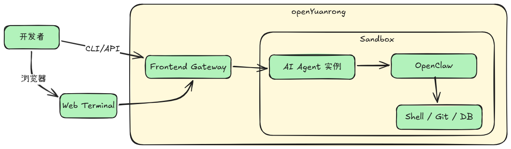
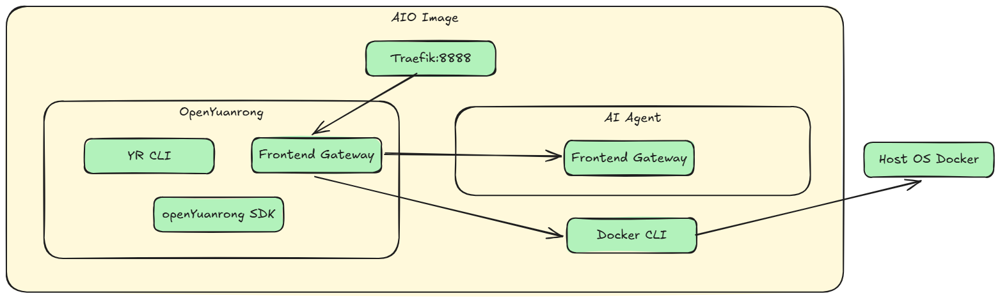
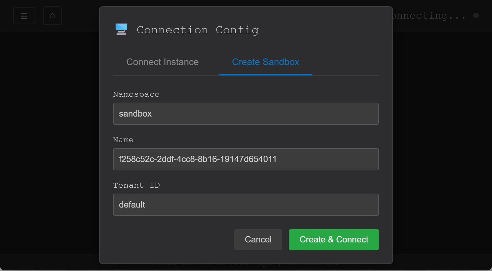
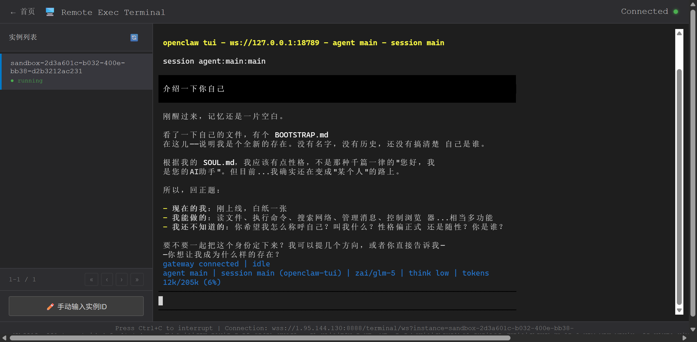

# openYuanrong 运行 OpenClaw 实战指南

## 引言

在 AI 时代，本地 Agent 工具正在重新定义人机协作的方式。OpenClaw（曾用名 Clawdbot）是一款具备高度主动性的本地 Agent 工具，它深入系统底层，可执行 Shell 命令、自动化提交 Git PR、管理数据库。

但 OpenClaw 依赖复杂的本地环境配置：Node.js、Python、Docker、各类 API Key...每一步都可能让开发者望而却步。

**openYuanrong** 作为一款 Serverless 分布式计算引擎，提供了一种全新的解决思路：将完整的 AI Agent 运行环境封装到一个沙箱中，用户只需启动沙箱，就能直接使用这些强大的 AI 工具。

本文将详细介绍如何基于 openYuanrong 运行 OpenClaw，带你体验「一键启动，即刻使用」的便捷。



---

## 一、技术架构解析

### 1.1 openYuanrong 沙箱的核心能力

openYuanrong 是 openEuler 社区开源的 Serverless 分布式计算引擎，其核心设计理念是**以单机编程体验简化分布式应用开发**。在 AI Agent 场景中，openYuanrong 提供了：

- **多语言运行时**：支持 Python、Java、C++、Go 等多种编程语言
- **函数即服务**：每个 AI Agent 作为一个「函数」运行，实现资源隔离和弹性伸缩
- **Web 终端**：内置浏览器终端，通过 WebSocket 实时交互


### 1.2 openYuanrong 沙箱镜像结构

基于 Ubuntu 24.04 实现了 openYuanrong All In One 镜像，其核心镜像组成如下图所示：



---

## 二、快速部署

### 2.1 一行命令启动

无需任何配置，一条命令即可启动完整的 AI Agent 运行环境：

```bash
docker run -d \
  -p 8888:8888 \
  -v /var/run/docker.sock:/var/run/docker.sock \
  swr.cn-southwest-2.myhuaweicloud.com/openyuanrong/openyuanrongaio:latest
```

启动后访问 Web 终端：`https://127.0.0.1:8888/terminal`

> 容器镜像默认仅开启 **HTTPS**（8888），不提供 HTTP 明文端口。



---

## 三、进入 Agent 世界

在 Web 终端中执行：

```bash
# 设置 APIKEY，以 ZAI 举例
export ZAI_API_KEY=xxx

# 非交互式初始化
openclaw onboard \
    --non-interactive \
    --accept-risk \
    --auth-choice zai-cn \
    --skip-channels \
    --skip-skills \
    --skip-ui

# 启动 Gateway 服务
openclaw gateway >> openclaw.log 2>&1 &

# 启动 TUI 界面
openclaw tui
```



---

## 四、从源码构建镜像

```bash
cd yuanrong/example/aio

# 确保启用 BuildKit
export DOCKER_BUILDKIT=1

# 构建镜像
docker build -t my-ai-sandbox:latest .
```

---

## 五、结语

通过 openYuanrong 沙箱，AI Agent 的使用门槛被大幅降低。用户无需关心环境配置、依赖安装、版本兼容等繁琐问题，秒级启动容器，就能直接进入 AI 辅助编程的工作流。

这正是 Serverless 架构的魅力所在：让开发者专注于业务逻辑，而非基础设施。无论是个人开发者快速体验，还是企业级部署 OpenClaw，openYuanrong 都提供了一种优雅的解决方案。

---

## 六、相关资源

- openYuanrong 官网：https://openyuanrong.org
- 示例代码：[yuanrong/example/aio](https://gitcode.com/openeuler/yuanrong/tree/br_feature_sandbox/example/aio)
- 文档中心：https://pages.openeuler.openatom.cn/openyuanrong/
